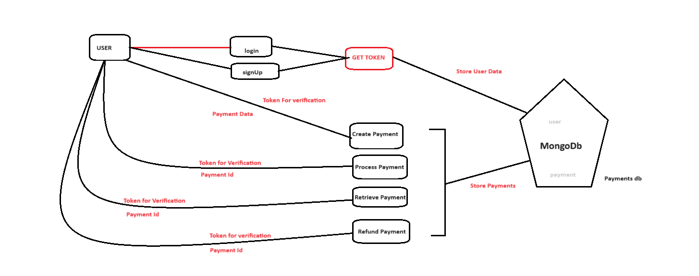

# payment gateway backend Application

## hosted Link : https://payment-gateway-2-aacu.onrender.com/ (**Take Some time to open because it hosted on free server, so pls wait**)

## To test apis, go to Swagger https://payment-gateway-2-aacu.onrender.com/api-docs || https://payment-gateway-1-brea.onrender.com/api-docs

### You can also test using postman etc. All api endpoints details given in api-docs

## Run application Locally

### clone this repo

### npm i

### change 'server' to 'http://localhost:3000' in swagger.js to run swagger locally

### npm start, run server

## EndPoints

### 1. "/api/auth/signup" => Need to signUp first to get token and to make payment or anything.

### 2. "api/auth/login" => Login to get token which will used to verify for making payments or for doing anything related to payment;

### 3. "/api/payment" => provide token to header first and create payment providing amount and currency.

### 4. "/api/payment/process/:id => Process payment by providing product id and token for verification, which you get by creating payment and on signin.

### 5. "/api/payment/:id => Retrive payment information by providing product id and token for verification, which you get by creating payment and on signin.

### 6. "/api/payment/refund/:id" => Get refund by providing product id and token.

## Features

- **Payment Processing**: Handle payment requests and process transactions securely.
- **Transaction Management**: Manage transactions, including retrieval and updates.
- **Security**: Implement secure payment handling and data encryption.
- **API Documentation**: Comprehensive documentation for API endpoints.

## Technologies Used

- **Node.js**: Backend server environment.
- **Express.js**: Framework for building RESTful APIs.
- **MongoDB**: Database for storing transaction and payment data.
- **bcrypt**: For Password Hashing and for security.
- **JWT**: JSON Web Tokens for authentication.

# System Design

